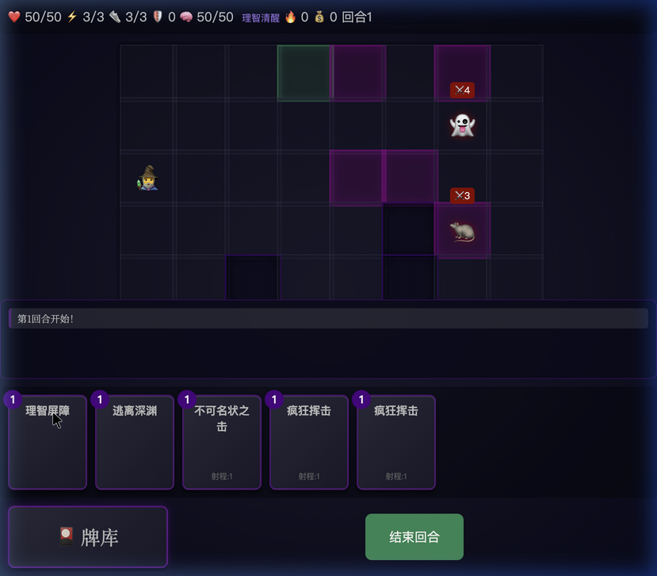
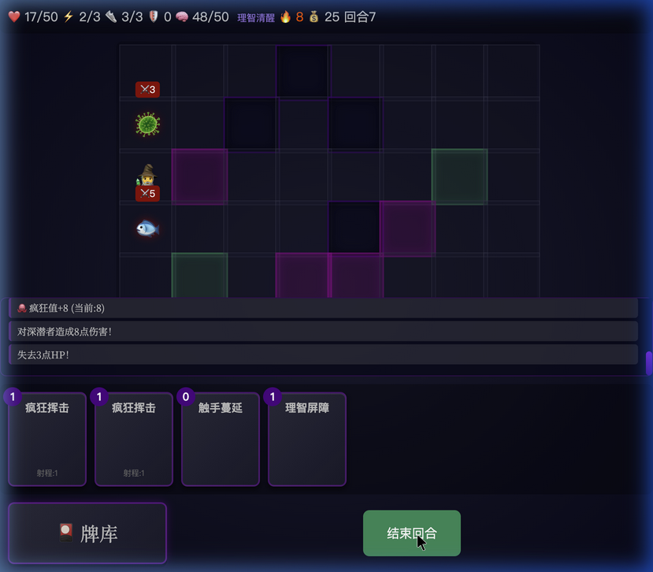

# 🐙 深渊召唤 (The Call of Cthulhu)

> "那永恒长眠的并非亡者，在诡异的万古中，即使死亡本身亦会消逝。"

一款受克苏鲁神话启发的 **Roguelike 卡牌战棋游戏**，融合了《杀戮尖塔》的卡牌构筑和战棋策略移动。

<p align="center">
  
  
</p>

---

## 🎮 游戏特色

- **30+ 张独特卡牌** — 攻击/防御/技能/移动四大类型，支持升级
- **三大徽章职业** — 🐙 深渊使者（爆发攻击）| 👁️ 旧日支配者（反弹防御）| 🎭 黄衣信徒（恐惧控制）
- **5×8 战棋网格** — A\* 寻路、Bresenham 视线检测、地形效果
- **理智值 (SAN) 系统** — 6 级状态，低理智触发疯狂突变与卡牌扭曲
- **24×24 手绘像素精灵** — 克苏鲁氛围的程序化像素动画
- **Roguelike 地图** — 多路线分支，7~8 场战斗通关，事件/商店/休息站
- **墓地/洗牌机制** — 完整的抽牌堆-手牌-弃牌堆-墓地循环

---

## 🚀 快速开始

### 依赖

- Node.js ≥ 18
- npm ≥ 9

### 本地运行

```bash
# 克隆仓库
git clone https://github.com/yourusername/call-of-cthulhu-game.git
cd call-of-cthulhu-game

# 安装依赖
npm install

# 启动开发服务器
npm run dev
```

打开浏览器访问 `http://localhost:5173`

### 生产构建

```bash
npm run build     # 构建到 dist/
npm run preview   # 本地预览生产包
```

---

## 🛠️ 技术栈

| 层 | 技术 |
|---|---|
| 语言 | TypeScript 5 |
| 渲染 | PIXI.js 8 (WebGL) |
| 状态 | Zustand |
| 构建 | Vite 7 |
| 样式 | CSS3 (自定义属性 + 动画) |
| 音效 | Web Audio API (程序化生成) |

### 核心算法

- **A\* 寻路** — 敌人智能绕障移动
- **Bresenham 视线** — 远程攻击遮挡检测
- **空间哈希网格** — O(1) 碰撞查询
- **ActionQueue** — 取代 `setTimeout`，确保战斗动作时序

### 项目结构

```
src/
├── core/            # 核心：Game、GameState、EventBus、SceneRouter
├── data/            # 数据：卡牌、徽章、敌人、商店
├── renderers/       # 场景渲染器：战斗、地图、奖励、徽章选择
├── systems/         # 系统：战斗、输入、音效、PIXI渲染、像素精灵
├── types/           # TypeScript 类型定义
├── css/             # 样式：主题 + 基础
└── index.html       # 入口
```

---

## 🎯 玩法概览

1. **选择徽章** — 决定你的战斗风格
2. **探索地图** — 在分支路线中选择战斗/事件/商店
3. **战棋战斗** — 在网格上移动并打出卡牌
4. **收集强化** — 战斗胜利获得新卡牌/升级
5. **管理理智** — 强卡消耗理智，低理智触发疯狂
6. **击败Boss** — 通关 3 层深渊

### 👹 敌人阵容

| 类型 | 名称 |
|------|------|
| **Boss** | 深渊领主 |
| **精英** | 深潜者祭司、修格斯、星之眷族 |
| **普通** | 深潜者、食尸鬼、古老者、夜魇、无形之子 等 |

---

## 📱 兼容性

Chrome 80+ · Firefox 80+ · Safari 14+ · Edge 80+

## 📄 许可证

[MIT License](LICENSE)

## 🙏 致谢

- 灵感：《杀戮尖塔》、《暗黑地牢》
- 克苏鲁神话：H.P. Lovecraft
- 字体：Fusion Pixel

---

**🐙 愿古神庇佑你的理智... 或者不然。**
